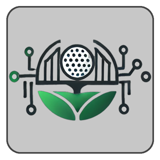
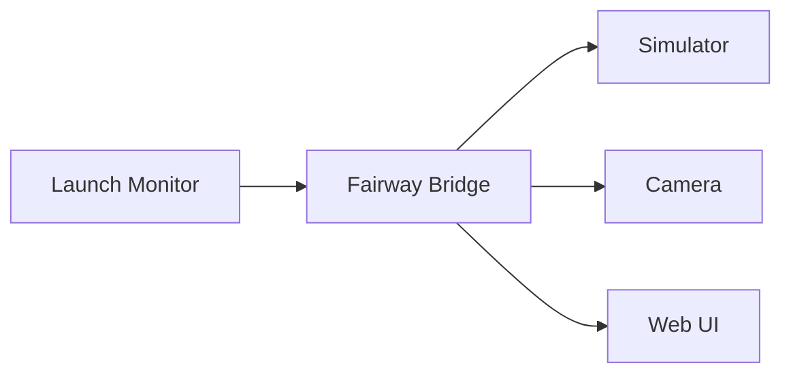
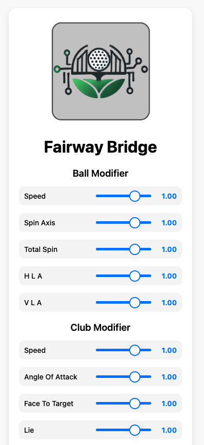

<p align="center">
  
</p>

<h1 align="center">Fairway Bridge (Beta)</h1>
<h3 align="center">Fairway Bridge is an application that connects launch monitors, simulators, and cameras.</h3>
<p align="center">
  
  <a href="https://github.com/401unauthorized/fairway-bridge#readme" target="_blank">
    
  </a>
  <a href="https://github.com/401unauthorized/fairway-bridge/graphs/commit-activity" target="_blank">
    
  </a>
  <a href="https://github.com/401unauthorized/fairway-bridge/blob/master/LICENSE" target="_blank">
    
  </a>
  <a href="https://paypal.me/stephenmendez401" target="_blank">
    
  </a>
</p>


## 📋 Table of Contents

- [Overview](#-overview)
- [Features](#-features)
- [Installation](#-installation)
- [How to Run the Application](#-how-to-run-the-application)
- [Supported Hardware and Simulators](#%EF%B8%8F-supported-hardware-and-simulators)
- [CLI Usage and Parameters](#-cli-usage-and-parameters)
- [API / User Interface](#-api--user-interface)
- [Future Work](#-future-work)
- [Contributing](#-contributing)
- [Supporting Developers](#-supporting-developers)
- [License](#-license)


## 👀 Overview

Fairway Bridge serves as the central connection point in a golf simulation system:



- **Data Ingestion:** Integrates with various launch monitors to capture essential ball and club metrics (e.g., speed, spin, trajectory).

- **Data Processing:** Transforms and modifies the raw shot data to ensure it meets the requirements for accurate simulation.

- **Data Routing to Simulation Software:** Passes the processed information to compatible golf simulation software for real-time visual feedback.

- **Media Capture:** Interfaces with supported cameras (such as GoPro models) to record swing videos for playback and analysis.

- **Data Logging:** Records raw and modified shot data into a CSV file, preserving detailed shot history for further analysis.

- **Web-Based User Interface:** Provides a comprehensive web UI for configuration, monitoring, and displaying real-time statistics and logs.


## 🎛 Features

Fairway Bridge was created to overcome real-world challenges in integrating launch monitor hardware and to bypass the limitations of traditional connectivity methods. Acting as a reliable integration layer, it meets the following needs:

- **Network-Based Launch Monitor Connectivity:**  
  Connect Launch Monitors to Simulators over a network instead of relying on Bluetooth, enabling a more flexible and dependable setup.


- **Use of Alternative Golf Balls:**  
  Leverage almostGOLF balls with select launch monitors for a quieter experience, while still capturing accurate data.


- **Ability to Fine-Tune Data:**  
  Adjust real-time modifiers that influence shot data, allowing you to modify ball speed, spin, and other parameters. This feature is especially useful for simulating different conditions or correcting data discrepancies.


- **Flexible Simulator Configurations:**  
  Seamlessly switch between different simulator setups, making the application adaptable to a variety of simulation environments and user needs.


- **Comprehensive Data Logging:**  
  Capture and store both raw and adjusted shot data in a CSV file, facilitating detailed analysis and performance tracking over time.


- **Cost-Effective Media Integration:**  
  Leverage affordable, off-the-shelf cameras to automate swing video recording, providing valuable playback and analysis capabilities.


- **Enhanced Display and Control:**  
  Access real-time statistics, configuration settings, and monitoring features through a user-friendly web interface that supports multiple devices, including monitors and touchscreens.


## 💾 Installation

### Prerequisites

- **Go:** Version 1.23 or later (visit [golang.org](https://golang.org/doc/install) for installation instructions).
- **Git:** For cloning the repository.

### Steps

1. **Clone the Repository:**
   ```bash
   git clone https://github.com/401unauthorized/fairway-bridge.git
   cd fairway-bridge
   ```

2. **Build the Application:**
   ```bash
   make
   ```

3. **Prepare the Environment:**
    - Ensure your system has access to your required hardware (launch monitor, simulator, camera).
    - Create necessary directories (e.g., for logs and video files) if not already present.


## 🔌 How to Run the Application

### Shot Emulation
You can test the system without needing any physical hardware by running the application in virtual mode. For example:

```bash
fairway-bridge -launch-monitor=virtual -simulator=virtual -camera=virtual
```

When you run this command, the application will generate a `fairway-bridge.log` file, which you can check to verify that everything is working as expected. 

The program will prompt you in the terminal to enter a distance in yards. Based on your input, it uses a **simple algorithm to emulate ball and club data** to match that distance and sends the resulting data to the virtual simulator.

Alternatively, you can run:

```bash
fairway-bridge -launch-monitor=virtual -simulator=GSPRO -camera=virtual
```

This command allows you to send shots to an actual simulator (GSPro) using the same basic yards-to-shot data algorithm. This setup provides a convenient way to test your simulator software without needing a real launch monitor—and it can even be a fun way to play around when you're bored.

### Capture Real Shots

1. **Set Up Hardware:**  
   Ensure that your launch monitor, simulator, and (if applicable) camera are connected and configured.


2. **Build and Configure:**  
   Follow the [Installation](#installation) steps and adjust CLI parameters as needed for your setup.


3. **Launch the Application:**
   Run the compiled binary with your configuration flags. The application will:
    - Parse and display configuration settings.
    - Start the API server for the web interface.
    - Initiate camera capture (if enabled).
    - Provide connectivity for the launch monitor and simulator.
    - Log system activity and display a message indicating that servers are running.


4. **Access the Web Interface:**  
   Open your web browser and navigate to the address specified by the `-http-ip` and `-http-port` flags (e.g., [http://127.0.0.1:2484/settings](http://127.0.0.1:2484/settings)).


5. **Connect Launch Monitor**  
   **Note:** To connect your Garmin R10, open the Garmin Golf app and select **E6 Connect** in the "Other Simulators" section. Then, set the IP address and port to match the values you configured in Fairway Bridge via the CLI.


6. **Terminate the Application:**  
   Press **Ctrl+C** to safely shut down the system. The application ensures proper shutdown procedures for all connected hardware.


## ⛳️ Supported Hardware and Simulators

### Launch Monitors

Fairway Bridge supports multiple launch monitor systems. The launch monitor is specified via the `-launch-monitor` flag. Example systems include:
- R10
- Virtual (emulated launch monitor)
- *(Future releases may support additional launch monitors.)*

### Simulators

The simulator is defined using the `-simulator` flag. Supported simulators include:
- GSPro
- Virtual (emulated simulator)
- *(Future releases may support additional simulators.)*

### Cameras

The project includes support for a camera controller, currently utilizing a GoPro integration (`GoPro7`) for the GoPro Hero 7. This allows for video capture during simulation sessions.


## 🛠 CLI Usage and Parameters

Fairway Bridge is configured via command-line flags. Below are the main parameters:

### Launch Monitor

- **`-launch-monitor`** (string, **required**):  
  Name of the launch monitor (e.g., "R10", "Virtual").

### Simulator

- **`-simulator`** (string, **required**):  
  Name of the simulator (e.g., "GSPro", "Virtual").
- **`-simulator-ip`** (string, default: `127.0.0.1`):  
  IP address for the simulator.
- **`-simulator-port`** (int, default: `921`):  
  Port for the simulator.

### Bridge (Core) Settings

- **`-bridge-ip`** (string, default: `127.0.0.1`):  
  IP address for Fairway Bridge.
- **`-bridge-port`** (int, default: `2483`):  
  Port for Fairway Bridge.
- **`-bridge-log-file`** (string, default: `fairway-bridge.log`):  
  Path to the log file.
- **`-bridge-log-type`** (string, default: `CONSOLE`):  
  Logging output type (e.g., "CONSOLE", "JSON").
- **`-bridge-shot-file`** (string, default: `./shots.csv`):  
  File to store shot data.

### HTTP Server (UI)

- **`-http-ip`** (string, default: `127.0.0.1`):  
  IP address for the HTTP server.
- **`-http-port`** (int, default: `2484`):  
  Port for the HTTP server.

### Camera Settings

- **`-camera`** (string, **required**):  
  Name of the camera. (e.g., "GoPro7", "Virtual).
- **`-camera-video-dir`** (string, default: `./recordings/`):  
  Directory to save video files.
- **`-camera-auto-stop-seconds`** (int, default: `5`):  
  Duration (in seconds) before auto-stopping video capture.
- **`-camera-override-video`** (bool, default: `false`):  
  If enabled, always overwrite the same video file instead of creating new ones.
- **`-camera-network-ip`** (string, default: `10.5.5.100`):  
  Local IP address for outbound camera connections.

### Example Command

```bash
./fairwaybridge \
  -launch-monitor "R10" \
  -simulator "GSPRO" \
  -simulator-ip "192.168.1.100" \
  -simulator-port 921 \
  -bridge-ip "192.168.1.100" \
  -bridge-port 2483 \
  -http-ip "192.168.1.100" \
  -http-port 2484 \
  -bridge-log-file "fairway-bridge.log" \
  -bridge-shot-file "shots.csv" \
  -camera="VIRTUAL" \
  -camera-video-dir "./recordings" \
  -camera-auto-stop-seconds 5 \
  -camera-override-video \
  -camera-network-ip "10.5.5.100"
```

This command runs the Fairway Bridge application with a specific configuration. Here's what each part does:

- **`./fairwaybridge`**:  
  Executes the Fairway Bridge binary.

- **`-launch-monitor "R10"`**:  
  Specifies that the launch monitor to be used is the Garmin R10 model.

- **`-simulator "GSPRO"`**:  
  Sets the simulator to GSPro.

- **`-simulator-ip "192.168.1.100"` & `-simulator-port 921`**:  
  Configures the simulator's IP address and port for network communication.

- **`-bridge-ip "192.168.1.100"` & `-bridge-port 2483`**:  
  Sets the IP address and port for the Fairway Bridge application to use for its core functionality.

- **`-http-ip "192.168.1.100"` & `-http-port 2484`**:  
  Determines the IP address and port for the embedded HTTP server, which serves the web-based user interface.

- **`-bridge-log-file "fairway-bridge.log"`**:  
  Specifies the log file location for Fairway Bridge's output logs.

- **`-bridge-shot-file "shots.csv"`**:  
  Sets the file where shot data will be recorded in CSV format.

- **`-camera="VIRTUAL"`**:  
  Indicates that the camera to be used is virtual, meaning it simulates camera behavior.

- **`-camera-video-dir "./recordings"`**:  
  Designates the directory where recorded video files should be saved.

- **`-camera-auto-stop-seconds 5`**:  
  Sets the duration for video capture to 5 seconds before auto-stopping.

- **`-camera-override-video`**:  
  When enabled, the application will always overwrite the same video file instead of creating new files.

- **`-camera-network-ip "10.5.5.100"`**:  
  Configures the local IP address to be used for outbound camera connections.


## 🌐 API / User Interface

> The User Interface and API are still under development and will be updated frequently until the official release.

<div style="display: flex; align-items: flex-start;">
  <div style="flex: 1; padding-right: 20px;">
    <h3>Static Content</h3>
    <ul>
      <li><strong>Root (/assets):</strong> Serves static files (HTML, CSS, images) from the <code>Assets</code> directory.</li>
      <li><strong>TV Page (/tv):</strong> Loads a dedicated TV display page (from <code>Assets/tv.html</code>).</li>
      <li><strong>Settings Page (/settings):</strong> Displays the settings page (from <code>Assets/settings.html</code>).</li>
    </ul>
    <h3>API Endpoints</h3>
    <ul>
      <li><strong>Modifiers:</strong>
        <ul>
          <li><strong>GET /modifiers:</strong> Retrieves the current modifier values (e.g., ball and club data).</li>
          <li><strong>PUT /modifiers:</strong> Updates modifier values using the provided JSON data.</li>
          <li><strong>POST /modifiers/save:</strong> Saves the current modifier settings (currently a placeholder).</li>
        </ul>
      </li>
      <li><strong>Statistics:</strong>
        <ul>
          <li><strong>GET /stats-image:</strong> Returns an image for shot statistics from the Assets folder (currently a placeholder).</li>
        </ul>
      </li>
      <li><strong>Logs:</strong>
        <ul>
          <li><strong>GET /logs:</strong> Retrieves the most recent system logs in JSON format (e.g., the last 100 log lines).</li>
        </ul>
      </li>
      <li><strong>File Upload:</strong>
        <ul>
          <li><strong>POST /upload:</strong> Accepts file uploads (e.g., updated stats images) and stores them in the Assets folder.</li>
        </ul>
      </li>
      <li><strong>Camera Control:</strong>
        <ul>
          <li><strong>POST /camera/start:</strong> Initiates camera capture with an optional delay specified via a query parameter (<code>delay</code>).</li>
          <li><strong>POST /camera/stop:</strong> Stops the ongoing camera capture.</li>
          <li><strong>POST /camera/save:</strong> Saves the most recent camera recording.</li>
          <li><strong>POST /camera/delete:</strong> Deletes the most recent camera recording.</li>
        </ul>
      </li>
    </ul>
    <p>
      The API server is built using the Gin framework (in release mode) and listens on the IP address and port specified in the configuration.
      This setup enables both user interface interactions and automated API requests to control various aspects of Fairway Bridge.
    </p>
  </div>
  <div style="flex: 0 0 auto;">
    
  </div>
</div>


## 🚧 Future Work

- **R10 Integration:**  
  Detailed instructions for connecting and configuring the R10 device will be provided in an upcoming update.

- **Enhanced UI Features:**  
  Planned improvements include advanced real-time analytics, additional data visualizations, and extended configuration options.

- **Extended System Support:**  
  Future releases may integrate more launch monitors, simulators, and camera models to broaden compatibility.


## 🤝 Contributing

Contributions, issues and feature requests are welcome!

Feel free to check [issues page](https://github.com/401unauthorized/fairway-bridge/issues). You can also take a look at the [contributing guide](https://github.com/401unauthorized/fairway-bridge/blob/main/CONTRIBUTING.md).


## 😃 Supporting Developers

Give a ⭐️ if this project interests you!

Consider making a donation of any amount!

<a href="https://paypal.me/stephenmendez401" target="_blank">
  
</a>


## 📝 License

Copyright 2025 Stephen Mendez

Licensed under the Apache License, Version 2.0 (the "License");
you may not use this file except in compliance with the License.
You may obtain a copy of the License at

http://www.apache.org/licenses/LICENSE-2.0

Unless required by applicable law or agreed to in writing, software
distributed under the License is distributed on an "AS IS" BASIS,
WITHOUT WARRANTIES OR CONDITIONS OF ANY KIND, either express or implied.
See the License for the specific language governing permissions and
limitations under the License.


**Trademark Notices**

- **almostGOLF** is a trademark of almostGOLF
- **Garmin R10** is a trademark of Garmin International, Inc.
- **GSPro** is a trademark of GSPro.

All other trademarks referenced herein are the property of their respective owners. Fairway Bridge is not affiliated with or endorsed by the trademark holders.